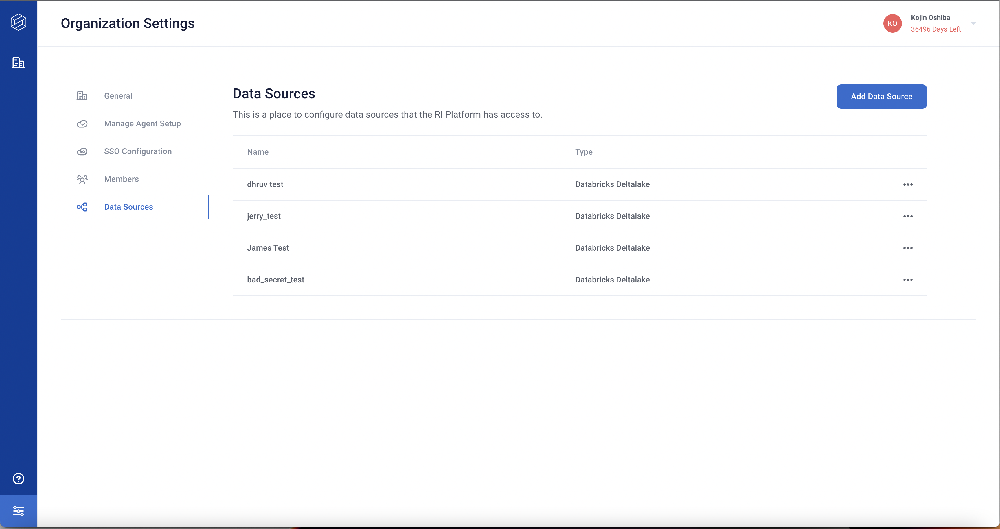

# Configuring data sources

Administrators can configure data sources that the RI Platform can access.
Sensitive information, such as access tokens, are stored in a secret manager
service built using [Hashicorp Vault](https://developer.hashicorp.com/vault/docs/what-is-vault).

## Supported data sources

The RI Platform supports the following data sources.

### Configurable through the RI Platform UI

The [Databricks Deltalake](/for_data_scientists/how_to_guides/integrations/data/databricks_deltalake.md) data source can be configured directly from the web UI of an RI Platform instance.

### Configurable at deploy time

These sources can only be configured when deploying an RI Platform instance:

* Amazon S3 
* Google Cloud Storage

## Adding a data source

An administrator can add or modify a data source that RI Platform can use. 

1.  Sign in to a RIME instance.  
      The Workspaces page appears.
2.  Click the three-dot menu at the right side of a workspace and select *Manage Workspace*.  
      The Workspace Settings page appears.
3.  Click *Data Sources* in the left navigation bar.  
      The Data Sources configuration pane appears.
4.  Click *Add Data Source*.  
      The Add Data Source dialog box appears.
5.  In *Name*, type a name for the data source.
6.  From the *Data Source Type* drop-down, choose a type.
7.  In *Server Hostname*, type the fully-qualified domain name (FQDN) for the server.
8.  In *HTTP Path*, type the path to the data source.
9.  From the *Credentials Privilege* drop-down, choose a privilege level.
      | Level     | Description                                                                       |
      |-----------|-----------------------------------------------------------------------------------|
      | Workspace | All users share a single access token to authenticate.                            |
      | Members   | Each user configures their credentials and uses a personal token to authenticate. |
10. Click *Save*.

The new data source is now available to the RI Platform.

## Custom data sources

The RI Platform can load data from arbitrary sources defined in a Python file for use in a Firewall or stress test. To use a custom data source, pass a custom data dictionary to either the `Client.start_stress_test()` or the `Firewall.start_continous_test()` functions. The custom data dictionary used for a continuous test must specify:

* A file path to a Python file
* The name of a function in that Python file
* Arguments to that function, if any

The Python file specified in the custom data dictionary must provide any required credentials for access to the filepath where the data is located. The output of the data loading function must be a Pandas dataframe.

### Example stress test with a custom data source

The following code specifies a custom data dictionary and the Python SDK call that starts the stress test.

```
custom_config = {
    "run_name": "Weather Predictor Test",
    "data_info": {
        "type": "split",
        "ref_data_info": {
            "type": "custom",
            "load_path": "s3://rime-datasets/custom-loader-weather/custom_weather_loader.py",
            "load_func_name": "get_weather_data",
            "loader_kwargs_json": '{"start_time": 0, "end_time": 1758608114}',
        },
        "eval_data_info": {
            "type": "custom",
            "load_path": "s3://rime-datasets/custom-loader-weather/custom_weather_loader.py",
            "load_func_name": "get_weather_data",
            "loader_kwargs_json": '{"start_time": 0, "end_time": 1758608114}',
        },
    }
}

job = client.start_stress_test(
    test_run_config=custom_config,
)
```

The `custom_weather_loader.py` code specifies the actual data loading logic to use. This example parses data from an Amazon S3 bucket, but a custom data loader can be written to handle data from any source.

```
"""Data loader file for weather file."""
import boto3
from datetime import datetime
import pandas as pd
​
BUCKET_NAME = "rime-datasets"
ACCESS_KEY = "*access key*"
SECRET_ACCESS_KEY = "*secret key*"
​
​
def get_weather_data(start_time: int, end_time: int) -> pd.DataFrame:
    start_time = datetime.fromtimestamp(start_time)
    end_time = datetime.fromtimestamp(end_time)
​
    master_df = pd.DataFrame()
    s3 = boto3.resource('s3', aws_access_key_id=ACCESS_KEY, aws_secret_access_key=SECRET_ACCESS_KEY)
    my_bucket = s3.Bucket(BUCKET_NAME)
    for object_summary in my_bucket.objects.filter(Prefix="custom-loader-weather/"):
        if ".csv" in object_summary.key:
            date_str = object_summary.key.split("/")[1].replace(".csv", "")
            date_str = date_str.replace("day_", "")
            file_time = datetime.strptime(date_str, "%Y-%m-%d")
            if start_time <= file_time <= end_time:
                obj = s3.Object(BUCKET_NAME, object_summary.key)
                curr_df = pd.read_csv(obj.get()["Body"])
                master_df = pd.concat([master_df, curr_df], ignore_index=True)
    return master_df
```

### Example continuous test with a custom data source

Continuous tests rely on an established reference data source and do not need to specify one in the data dictionary. The contents of `custom_weather_loader.py` do not change, but the custom data dictionary is different.

```
incremental_config.= {
"eval_data_info": {
            "type": "custom",
            "load_path": "s3://rime-datasets/custom-loader-weather/custom_weather_loader.py",
            "load_func_name": "get_weather_data",
            "loader_kwargs_json": '{"start_time": 0, "end_time": 1758608114}',
}
}
```

<!--
-->