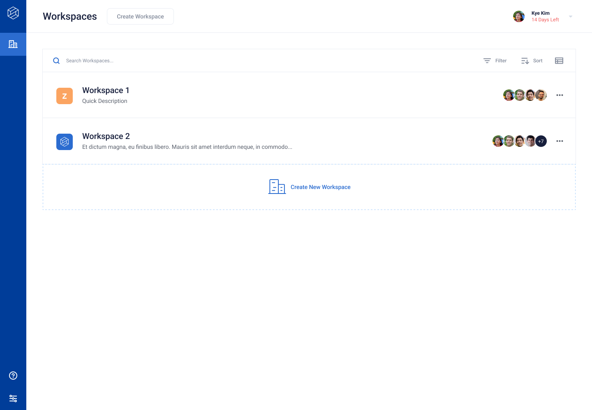

# Workspaces

## Overview
A workspace is an environment for organizing and accessing all of your Robust Intelligence assets (projects, stress test runs, firewalls, etc.).

* All the Robust Intelligence assets in a workspace are unique to that workspace.
* Users can navigate to a specific workspace from the organization view that shows all the workspaces.
* Users can navigate between workspaces using the left navigation bar.

## Initializations
* For completely new installations, an initial workspace is configured without an agent. An agent must be assigned to the workspace.
* For existing installations, all objects (projects, stress test runs, firewalls, etc.) are moved to a default "Workspace 1" and assigned the existing agent.
* To create a workspace, an admin must provide a name, description, assign agents, and select a default agent.

## Permissions
* Admin users:
  * can create workspaces from the UI for different teams
  * can edit a workspace by clicking "Manage Workspace" on the menu button
  * can delete a workspace
  * can view and use the workspaces
* Standard users:
  * can view and use the workspaces

## Settings
There are organization-level settings that impact all workspaces. There are also individual workspace-level settings that only impact a single workspace.

* Organization-Level settings include:
  * General Settings (Timezone and Audit Logs)
  * Managed Agent Setup
  * SSO Configuration
  * Members (User Management)
  * Data Sources Configuration
  * SMTP Configuration
* Workspace-Level settings include:
  * General (editing the setup and configuration of a workspace)
  * API Access Tokens
  * Agent Status (Status of agents assigned to workspace)
  * Managed Images (Shared across workspaces but visible at workspaces level)

## Workspaces and Agents
* To use a workspace, an admin must assign it at least one agent.
  * A workspace can have multiple agents associated with it.
* An agent can be associated with multiple workspaces.
* Each workspace must have a default agent specified. If an agent is not specified while executing a job, the default agent will be used to run the job.

