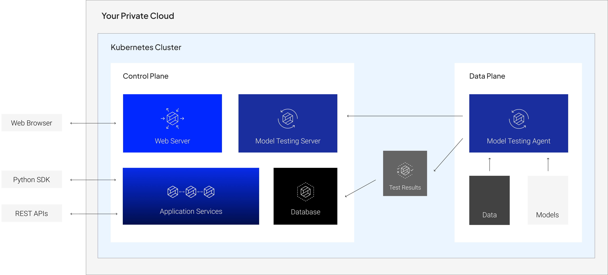

# Architecture Overview

In this configuration, **both planes** are hosted in your organization’s private cloud.

This means that you have **full control** over your deployment, from configuring routing rules (for the web client and API endpoints) to managing storage to optimizing compute for your model testing jobs.

## Cloud Services
AWS services utilized by the RI Platform include:
- IAM
  - managing roles for internal services, which involve:
    - reading and writing data from S3
    - building images and pushing them to ECR
    - autoscaling cluster nodes by changing autoscaling group targets
    - configuring DNS records in route53 for external access
- EKS/EC2/ELB
  - creating the Kubernetes cluster, its constituent nodes, and load balancers for external access
- Route 53/ACM
  - managing records for external access to API layer, validated by SSL certificates
- VPC
  - isolate the EKS cluster
- Secrets Manager
  - used during installation
- S3
  - for storing and serving data and models

Other cloud services utilized by the RI Platform include:
- Velero
  - for backup and disaster recovery
- OIDC Authentication (Optional)
  - integrating with your existing identity provider
- SMTP Service (Optional)
  - for email notifications related to model testing
- DataDog (Optional)
  - for cluster health monitoring

## Terraform
To reduce the manual effort involved in deploying the RI Platform, we provide template Terraform modules (which we will help you fill out) to handle cluster deployment.

For non-AWS deployments, the Robust Intelligence team will work with your DevOps team to design an appropriate integration strategy.
