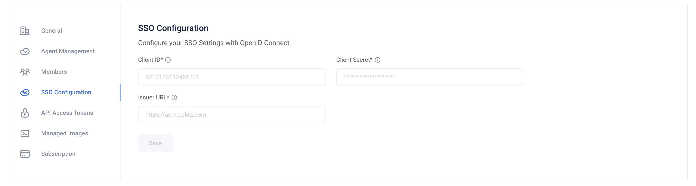

# SSO configuration

A user with administrative privileges on an RI Platform instance can configure
single sign-on (SSO) to integrate with an external identity provider. The RI
Platform supports the OpenID Connect (OIDC) authentication mechanism.

**Note**: Administrative operations cannot be performed while logged in using
SSO.

User accounts configured to use SSO cannot be [assigned membership](rbac.md)
in a workspace before logging in with SSO once.

## Configuring SSO

1.  Sign in to a user account that has administrative privileges for an RI
    Platform instance.  
    >    The Workspaces page appears.
2.  Click the *Settings* icon in the lower left.  
    >    The Organization Settings page appears.
3.  Click *SSO Configuration*.
    >   The SSO Configuration pane appears.
4.  In *Client ID*, type the client ID for OIDC.
5.  In *Client Secret*, type the client secret for OIDC.
6.  In *Issuer URL*, type the URL of the OIDC issuer.
7.  Click *Save*.

The RI Platform instance is now configured to use SSO authentication.
Add `https://rime.<domain>/v1/auth/oidc/callback` as a callback URL for the
OIDC provider. When this URL is not valid, attempting to log in results in a
403 Forbidden HTTP status code.

