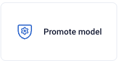
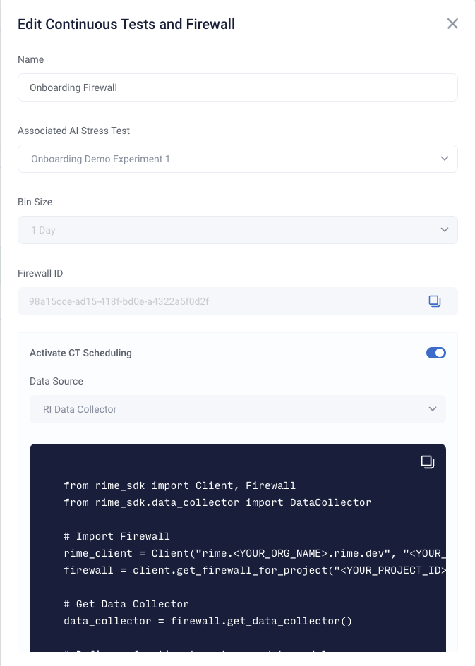
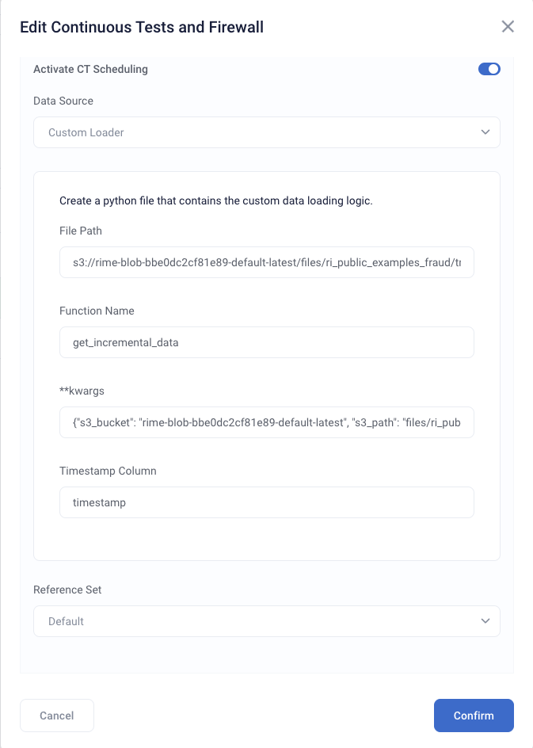

# Scheduling Continuous Testing Runs

Once a Firewall has been created, you can monitor your model on a regular schedule without have to do any manual work. In this guide, we will
show you how to create and update this schedule from the SDK and the UI. For more configuration information see the [Scheduled CT Configuration Page](/for_data_scientists/reference/tabular/scheduled_ct_configuration.md)

## Activating a Schedule

### Creating a Schedule with a New Firewall from SDK

{{ sdk_client_setup }}

After creating a project and running stress tests, a schedule can be created
when creating a firewall. To create a schedule, you will need to provide the location to pull data from as well as any arguments needed to access this location.
```python
project = rime_client.create_project("<NAME>", "<DESCRIPTION>")

# Run a stress test and wait until finished
job = client.start_stress_test("<YOUR_CONFIG>", project_id=project.project_id)
job.get_status(wait_until_finish=True)
test_run_id = job.get_test_run_id()

# Create a firewall with an active schedule. This will routinely read from
# the data collector and run tests once every bin_size time period (eg. once a day, week, etc...).
# No arguments are needed by the RIME Engine to access the data collector, since the service is internal
firewall = project.create_firewall(name: "<NAME>", bin_size="<BIN_SIZE>", test_run_id=test_run_id, run_ct_schedule=True, location_type="data_collector")
```


You can additionally provide parameters to process this data (eg. timestamp column names).
```python
data_params_dict = {
    "nrows": 100
}

# Create a firewall with an active schedule.
# The data loaded has a timestamp column defined above.
firewall = project.create_firewall(name: "<NAME>", bin_size="<BIN_SIZE>", test_run_id=test_run_id, run_ct_schedule=True, location_type="data_collector", data_params=data_params_dict)
```

Since each data location requires specific parameters for the RIME Engine to access and process the data, please visit the [Scheduled CT Configuration Page](/for_data_scientists/reference/tabular/scheduled_ct_configuration.md) to
learn more about configuration for different use cases.

### Creating a Schedule on an Existing Firewall from SDK
Firewalls without scheduling can enable scheduling at any time.
```python
# Get the firewall for a project
firewall = client.get_firewall_for_project("<YOUR_PROJECT_ID>")

# Activate a schedule
firewall.activate_ct_schedule(location_type="data_collector", reference_set_window=reference_set_bin, data_params=data_params_dict)
```

## Deactivating a Schedule from SDK

To deactivate a schedule for a firewall, simply run the following command.
```python
firewall.deactivate_ct_schedule()
```

## Activating and Deactivating through the UI

Within a project, from the stress test view, you can click on the "Promote Model" button to open up a settings view of the firewall.





After toggling to activate scheduled CT, you must choose where you want your data to come from.
The current supported options are Databricks DeltaLake, the Data Collector, or your own custom loader.

Delta Lake connections can be set up following the instructions in the [data sources setup guide](/for_admins/how_to_guides/data-sources.md)
You must then specify a table and timestamp column.


For the custom loader, you should specify the path of your custom loading file, the name of the function that loads the data, any relevant keyword arguments in json form, and the timestamp column.



## Extra Specifications

## Modifying the Reference Dataset
In addition to specifying access and process parameters, you can also modify the reference data that
tests are routinely run against.

By default, the reference set of CT runs is the same reference set as the stress test that the firewall is configured to use, but you may also use a rolling window or a specific time period.

From the UI, you can choose a reference dataset in the "Reference Set" dropdown and fill in the relevant fields.
For the non-default options, the reference dataset always comes from the same data source that is specified for CT scheduling.

You can also specify the reference dataset from the SDK.
```python
from datetime import datetime, timedelta

# Specify a duration for the rolling window.
# The reference set will change each period based on the window size
rolling_window_period = timedelta(days=1)
firewall.activate_ct_schedule(location_type="data_collector", rolling_window_duration=rolling_window_period)

# Specify a new time period as the reference set
reference_start_time = datetime(2022, 1, 3)
reference_end_time = datetime(2021, 1, 3)
reference_set_bin = (reference_start_time, reference_end_time)
firewall.activate_ct_schedule(location_type="data_collector", reference_set_window=reference_set_bin)
```

### Modifying Existing Schedules
To change the data location associated with your runs or the reference set, use the `update_location_info`
function.

```python
from datetime import datetime

# Specify a new time period as the reference set
reference_start_time = datetime(2022, 1, 3)
reference_end_time = datetime(2021, 1, 3)
reference_set_bin = (reference_start_time, reference_end_time)
firewall.update_location_info(location_type="data_collector", reference_set_time_bin=reference_set_bin)
```