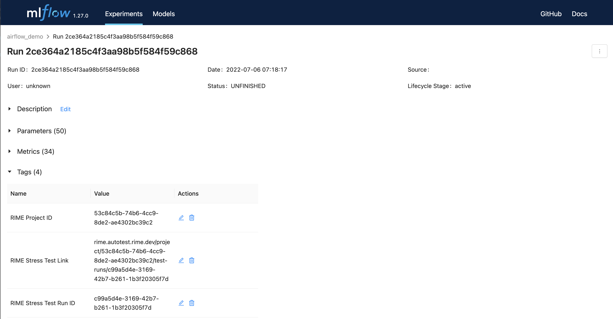
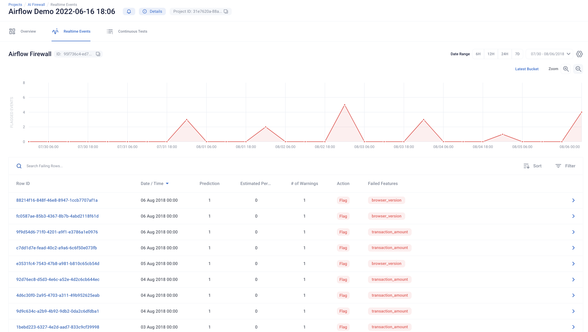

# RIME 🤝 Airflow

RIME integrates with Airflow. Airflow allows you to schedule RIME test runs,
 programmatically kick-off RIME and query for test results.

To get a better understanding
of the integration, take a look at the 
<a href="https://www.loom.com/share/e7596da7c13e40ce86ce7a913d925669" target="_blank">Airflow Demo Video,</a>
or follow along through the walkthrough below.
 
**Background**:

_You are a data scientist at a Payment Processing Company. The data science team has been tasked with implementing a Fraud Detection service and monitoring how that model performs over time._

_Your company's data infrastructure and ETL processes are all scheduled in Airflow, and your team uses MLFLow's model registry to track model versions and associated metadata._

**Overview**:

In this walkthrough, we will review 2 of RIME's core products - AI Stress Testing and AI Firewall.

- AI Stress Testing is used in the model development stage. Using AI Stress Testing you can test the developed model. RIME goes beyond simply optimizing for basic model performance like accuracy and automatically discovers the model's weaknesses.
- AI Firewall is used after the model is deployed. Using AI Firewall, you can automate the monitoring, discovery and remediation of issues that occur post-deployment. Additionally it automatically flags, blocks, or imputes erroneous data in real-time.

**Requirements**:

This script assumes you are using python version >= 3.8 and running MacOS or Linux. If you are using Windows, please run using WSL or contact an RI representative for assistance.

**Setup**:

First, download the associated [DAG definitions and startup script](https://www.dropbox.com/s/9ntzgp0onappuph/airflow.zip?dl=1). Unzip the file and navigate to the folder in your terminal. To make sure we connect to the correct RIME endpoint, set the `RIME_API_KEY` and `RIME_UPLOAD_URL`  environment variables to their appropriate values using, e.g., 
`export RIME_UPLOAD_URL=rime.<my_cluster>.rime.dev`. Please note that the cluster cannot be `localhost`.


If you already have a remote instance of Airflow running and wish to use that, assign the correct values to the RIME upload URL and API token variables directly in `airflow_demo.py` and upload to the appropriate DAG directory (e.g., the configured S3 bucket). Please ensure the required dependencies are installed. If you still wish to use MLflow, update the `MLFLOW_TRACKING_URI` variable to point to the correct server. You can then skip running the accompanying shell script.

The rest of the tutorial assumes you wish to run everything locally. Start from a fresh virtual environment

```bash
python -m virtualenv ./.venv && . ./.venv/bin/activate
```

and proceed by launching a standalone version of Airflow using the companion script `run_airflow.sh`. The script does the following:

- Install Airflow, MLflow, and the rime-sdk
- Move the DAGs defined in `airflow_demo.py` to the dag folder to be scheduled.
- Spin up the Airflow services (scheduler, database, web server, etc.) backed by a SQLite database
- Spin up an MLFLow server backed by a SQLite database to track the experiments

Once this is done, copy the password printed out by the script, and login to the local Airflow instance
at [http://localhost:8081/](http://localhost:8081/) using "admin" as the username.


Enable the "RIME_Stress_Testing" workflow to begin developing models. While you are waiting, you can continue the walkthrough below. 


The RIME DAGs shown on the Airflow webpage are defined in `airflow_demo.py`. These do the following:

- The first DAG (`RIME_Stress_Testing`) defines an automatic model development pipeline. It creates MLflow experiments for three different models and adds them to the model registry.  For each experiment, it
    - Trains the model on the reference split.
    - Evaluates the model using common metrics on the heldout evaluation split.
    - Uploads the model and data to the RIME cluster to stress test the trained models.
    - Queries the stress testing runs to add all metrics and test results to the MLFLow experiment.
    - Saves the model so it can be loaded in a framework-agnostic manner using MLflow's model logging API.

It then uses the stress testing results to select the best-performing model and promote it to production in MLflow. The model is wrapped with the AI Firewall to protect it in production.

This DAG is defined as follows:

```python
with DAG(
    dag_id="RIME_Stress_Testing",
    default_args=default_args,
    schedule_interval="@once", 
    start_date=DEPLOYMENT_DATE,
    catchup=False,
) as preprod_dag:
    create_project_task = PythonOperator(
        task_id="create_rime_project", python_callable=create_rime_project,
    )
    fetch_train_data_task = PythonOperator(
        task_id="fetch_train_data",
        python_callable=fetch_fraud_data,
        op_kwargs={"split": "train"},
    )
    fetch_test_data_task = PythonOperator(
        task_id="fetch_test_data",
        python_callable=fetch_fraud_data,
        op_kwargs={"split": "test"},
    )
    root = [fetch_train_data_task, fetch_test_data_task]
    log_results_to_mlflow_tasks = []
    model_types = [
        "catboost-classifier",
        "sgd-classifier",
        "logistic-regression-classifier",
    ]
    for i, (model_type) in enumerate(model_types):
        train_task = PythonOperator(
            task_id=f"train_model_{i}",
            python_callable=train_model,
            op_kwargs={"model_type": model_type,},
            show_return_value_in_logs=False,
        )
        model_val_kwargs = {"model_val": str(i)}
        model_upload_task = PythonOperator(
            task_id=f"upload_model_{i}",
            python_callable=upload_model,
            op_kwargs=model_val_kwargs,
        )
        ref_upload_task = PythonOperator(
            task_id=f"add_preds_and_upload_ref_dataset_file_{i}",
            python_callable=add_preds_and_upload_dataset_file,
            op_kwargs={"split": "train", **model_val_kwargs},
        )
        eval_upload_task = PythonOperator(
            task_id=f"add_preds_and_upload_eval_dataset_file_{i}",
            python_callable=add_preds_and_upload_dataset_file,
            op_kwargs={"split": "test", **model_val_kwargs},
        )
        stress_tests_task = PythonOperator(
            task_id=f"run_stress_test_{i}",
            python_callable=run_stress_test,
            op_kwargs=model_val_kwargs,
        )
        mlflow_task = PythonOperator(
            task_id=f"log_results_to_mlflow_{i}",
            python_callable=log_results_to_mlflow,
            op_kwargs=model_val_kwargs,
        )
        upload_tasks = [model_upload_task, ref_upload_task, eval_upload_task]
        root >> train_task >> upload_tasks >> stress_tests_task >> mlflow_task
        create_project_task >> stress_tests_task
        log_results_to_mlflow_tasks.append(mlflow_task)

    selection_task = PythonOperator(
        task_id="choose_best_model",
        python_callable=choose_best_model,
        op_kwargs={"model_types": model_types},
    )
    deploy_task = PythonOperator(
        task_id="transition_best_model_to_production",
        python_callable=transition_best_model_to_production,
    )
    create_firewall_task = PythonOperator(
        task_id="create_firewall", python_callable=create_firewall,
    )
    log_results_to_mlflow_tasks >> selection_task >> deploy_task >> create_firewall_task
```

The actual `python_callables` can be viewed in the downloaded `airflow_demo.py` file. 

You can view the DAG computation graph and monitor the development pipeline's progress in the Airflow webpage.


An MLflow tracking server was also launched as a part of this walkthrough. To view the model experiments, try navigating to [http://localhost:7081/](http://localhost:7081/).


As the `RIME_Stress_Testing` DAG is computed, the MLflow experiments and model registry will be populated with the model files, training and RIME metrics, and even the associated RIME web links. The best-performing model will be moved to production automatically.


Once this DAG completes, you can check out the RIME stress tests in the web interface
corresponding to your RIME_UPLOAD_URL. As mentioned above, the Stress Test URL is added to MLflow run tags under the key "RIME Stress Test Link" as well as to the run parameters. Navigate to the [local MLflow tracking server](http://localhost:7081/#/experiments/1/runs) to view the `airflow_demo` experiments, then click one of the runs (listed in the "Start Time" column) to view the tags.





From the experiment view, navigate to the link specified by the `RIME Stress Test Link` tag. 


Congrats! Your model is now live. Enable the "RIME_Firewall" DAG using the toggle in the Airflow web interface or by using the Airflow CLI to protect and monitor the model.


The `RIME_Firewall` DAG fetches batches of production data and feeds it to the model, running continuous tests on the data to monitor drift, anomalies, and other AI security threats.

This DAG is defined as follows:

```python
with DAG(
    dag_id="RIME_Firewall",
    default_args=default_args,
    schedule_interval="@daily",
    start_date=DEPLOYMENT_DATE,
    end_date=PRODUCTION_END_DATE,
    catchup=True,
) as prod_dag:
    interval_start = "{{ data_interval_start }}"
    interval_end = "{{ data_interval_end }}"
    fetch_prod_data_task = PythonOperator(
        task_id="fetch_production_data",
        python_callable=fetch_production_data,
        op_kwargs={"interval_start": interval_start, "interval_end": interval_end},
    )
    # Only run the firewall if the DF from fetch_production_data is not empty
    short_circuit_task = ShortCircuitOperator(
        task_id="continue_if_data_available",
        python_callable=continue_if_data_available,
    )
    get_project_task = PythonOperator(
        task_id="get_rime_project_id", python_callable=get_rime_project_id,
    )
    add_prod_preds_task = PythonOperator(
        task_id="add_prod_preds",
        python_callable=add_prod_preds_and_upload_dataset_file,
    )
    run_firewall_task = PythonOperator(
        task_id="run_firewall",
        python_callable=run_incremental_firewall,
        op_kwargs={"interval_start": interval_start},
    )
    fetch_prod_data_task >> short_circuit_task >> add_prod_preds_task >> run_firewall_task
    get_project_task >> run_firewall_task
```

This will run the firewall over the month of
production data. You can view the testing process in the Airflow UI.


After a few iterations, navigate to the Firewall link (in the target RIME project; also present in the MLflow production model registry) and evaluate the most recent evaluation bins.

