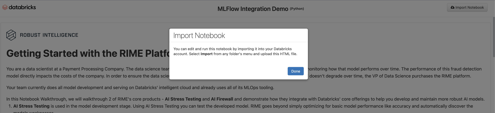
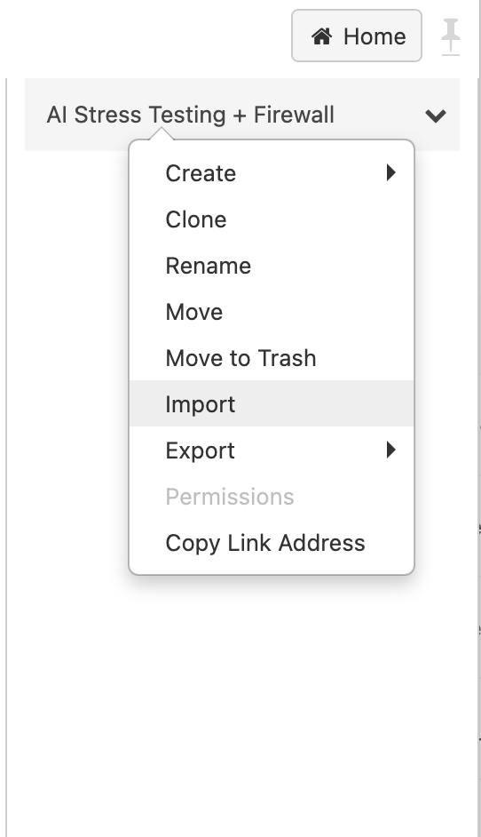
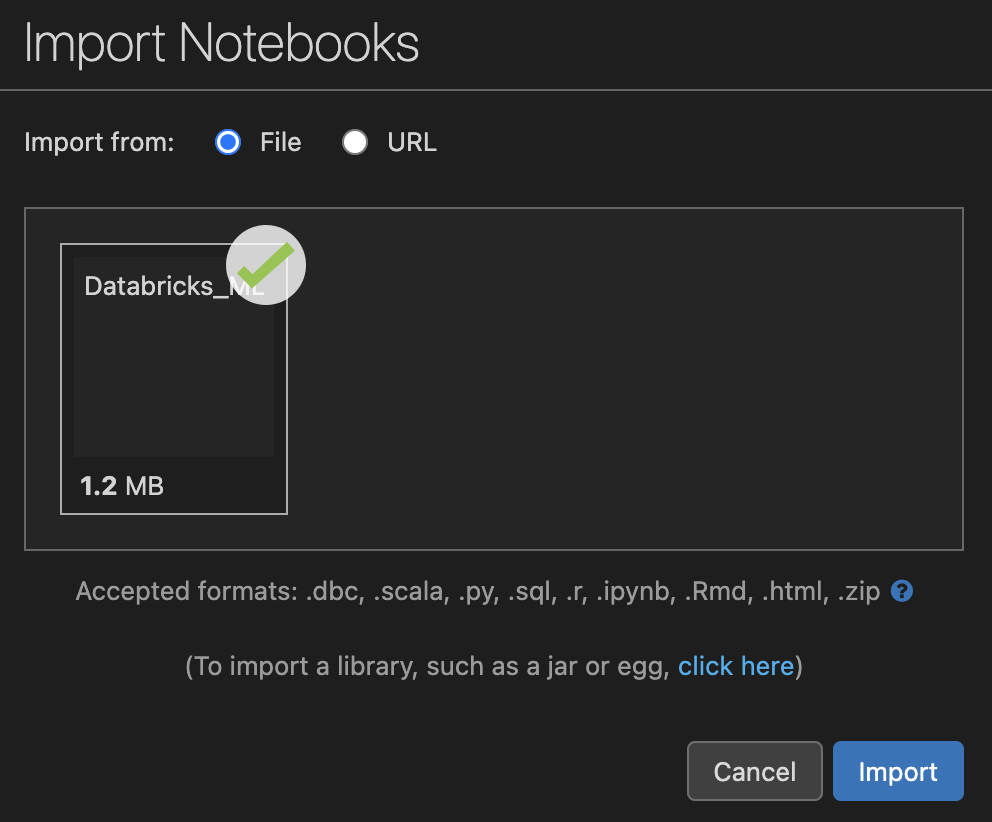

# RIME 🤝 Databricks

This walkthrough will cover how to integrate AI Stress Testing and the AI Firewall 
into your workflow on the Databricks platform. This assumes you have already set up your
Databricks account and have a cluster deployed. **Note:** since the walkthrough also
uses `mlflow`, the databricks runtime of the cluster must be an "ML" type (rather than standard).
An example supported runtime is `10.4 LTS ML`. If you see a '`ModuleNotFoundError`', it is likely you are using an
incompatible runtime, and certain components of the walkthrough won't function as expected.

First, download the [Databricks + MLflow Walkthrough Notebook here](https://drive.google.com/drive/u/0/folders/1Dd8fA5v5ggFm_F3Lnuy1Cs_YdYeOTakS). If you try to open it locally, you'll see instructions on how to **import the notebook** to your Databricks workspace. 

Specifically:

- Navigate to your Databricks workspace in the browser.
- Create a new folder in your target workspace. We will upload the walkthrough notebook here.
- Right click the folder and click `import`.

- Drag or select the path to the downloaded file (`Databricks_MLFlow_Integration_Demo.html`) and click `import`.

Once the notebook file has been imported, make sure you are attached to an active cluster and follow the instructions to see how AI Stress Testing enhances your existing model development process on Databricks and how the AI Firewall can monitor and secure your models once they are deployed.

