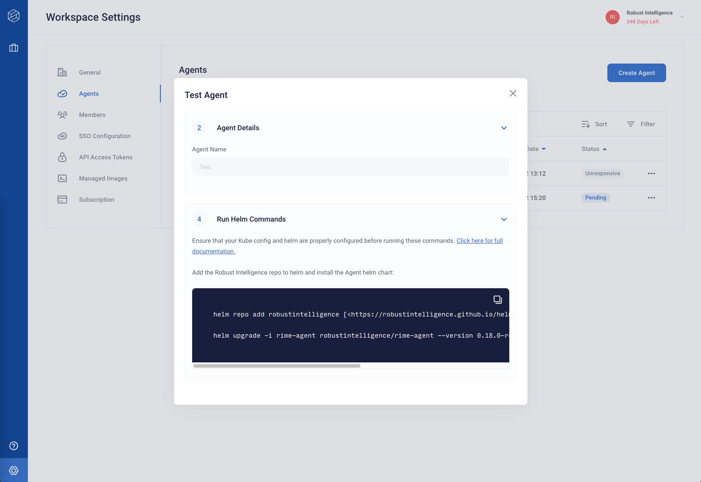

# Deploying the Agent

## Retrieving the Helm Commands

After completing the [Agent Configuration](agent_configuration.md), you should have received some Helm commands to install the agent's Helm chart.

These commands can also be retrieved by clicking on the row for the agent in the web client.



## Installing the Helm Chart

To deploy the agent, simple **run the provided commands**! Be sure the path to the downloaded `<AGENT_NAME>-values.yaml` file is correct.

(These are sample commands --- the ones you retrieve from the web client will have specific values.)
```
helm repo add robustintelligence [<https://robustintelligence.github.io/helm/>](<https://robustintelligence.github.io/helm/>) --force-update

helm upgrade -i rime-agent robustintelligence/rime-agent --version <VERSION> --values <PATH TO DOWNLOADED VALUES FILE>
```

## Using the Agent

Once successfully installed, you should see the created agent become "Active" on the Agents page within a couple of minutes.


You can troubleshoot your deployment using `kubectl` or other observability tools for your cluster:
- `kubectl get pods` should show 2 running pods (launcher and job monitor). Any errors in configuration or credentials will cause these pods to error. The output from this command should look similar to this:
  ```
  NAME                                             READY   STATUS      RESTARTS   AGE
  rime-agent-job-monitor-6bddd4697d-t9118          1/1     Running     0          3d6h
  rime-agent-launcher-56bc47549c-dod60             1/1     Running     0          3d6h
  ```
- `kubectl logs <pod-name>` will show logs of the running pods, which can be useful for debugging.

You can continue to use `kubectl` to debug any issues with your agent and testing jobs once you start using the RI Platform. Running tests on the RI Platform will cause the launcher to create more jobs/pods within the same namespace it is deployed into. Looking for these pods after launching tests can be a good sanity check that things are working properly.

Once your agent is "Active", you are ready to assign your agent to your workspace and begin running tests using Robust Intelligence!
