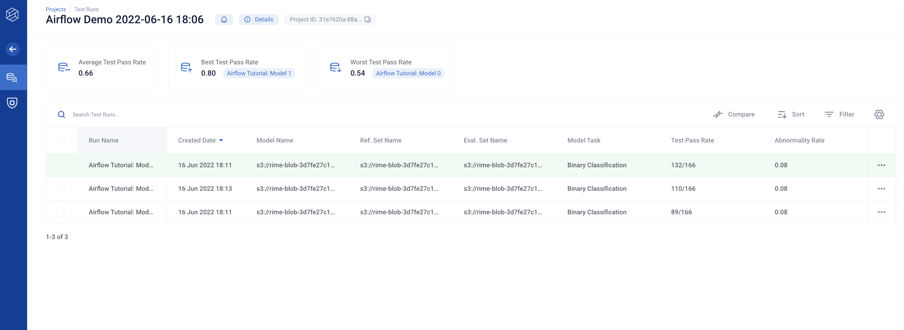
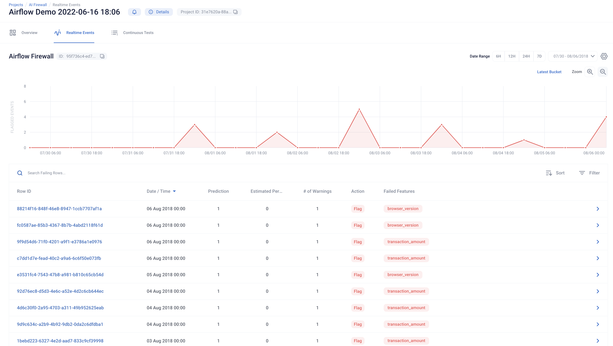

# Integrating Robust Intelligence with Airflow

This demo performs Robust Intelligence stress testing and monitoring within an Airflow DAG.

First, make sure the correct API key and cluser urls are stored in as environment
variables (`RIME_API_KEY` and `RIME_UPLOAD_URL`). You can modify these directly in the
 `airflow_demo.py` script as well prior to spinning up the local server.

To run, start the `run_airflow.sh` script. This will:

- Install airflow, mlflow, and the rime_sdk
- Move the DAGs defined in `airflow_demo.py` to the dag folder to be scheduled.
- Spin up the Airflow services (scheduler, database, web server, etc.) backed by a SQLite database
- Spin up an MLFLow server backed by a SQLite database to track the experiments

Once this is done, copy the password printed out by the script, and login to the local Airflow instance
at http://localhost:8080/ using "admin" as the username.

Enable the "RIME_Stress_Testing" and wait for it to complete.

Click through to view the computation graph and monitor the development pipeline's progress.

As this is running, you can
view the model experiments at the local MLFlow server by navigating to http://localhost:7081/.

This will be populated with the model files, training and metrics, and even the web links. The best-performing model will be moved to production.

Once the model development + stress testing DAG completes, check out the Stress Tests and Continuous Tests in the web interface
corresponding to your RIME_UPLOAD_URL.

Congrats! We've put a model in production. Enable the "RIME_Firewall" run using the toggle in the Airflow web interface, or by using the Airflow CLI.

This will run the Continuous Test over the month of
production data. You can view the testing process in the Airflow UI.

After a few iterations, navigate to the Firewall link (in the target Robust Intelligence project; also present in the MLFlow production model registry) and evaluate the most recent evaluation bins.

